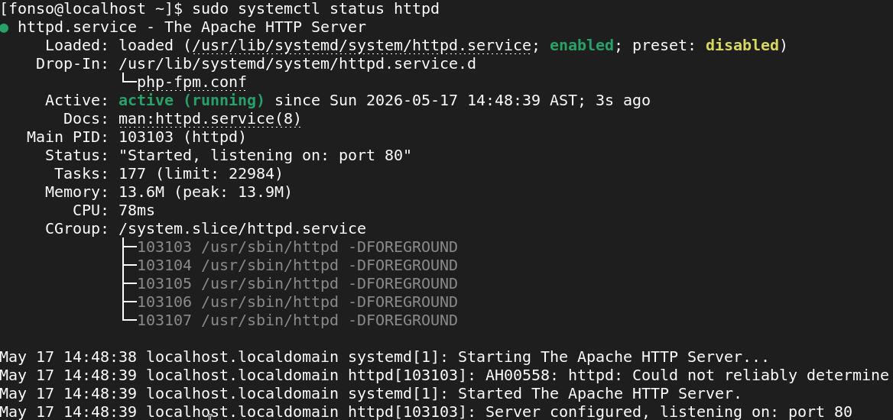
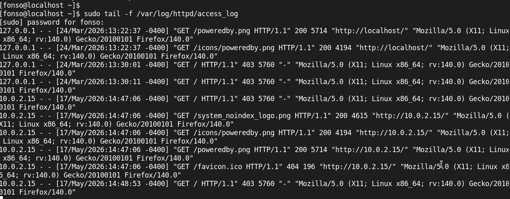
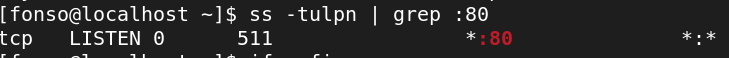

# Linux Web Server Lab

## Objective

Build a functional Linux web server using AlmaLinux and Apache.

## Technologies Used

- AlmaLinux
- Apache
- VirtualBox

## What I Learned

- Installing Apache
- Managing Linux services
- Using systemctl
- Reading logs
- Basic troubleshooting
- Understanding ports and connections
- Networking Verification

This lab helped me understand how Linux services work, how web servers listen for connections, and how troubleshooting starts
by investigating logs and service states.

## Commands Used

```bash
sudo dnf update -y
sudo dnf install httpd -y
sudo systemctl start httpd
sudo systemctl enable httpd
sudo systemctl status httpd
sudo systemctl stop httpd
journalctl -u httpd
tail -f /var/log/httpd/access_log
ip a
ss -tulpn | grep httpd
ss -tulpn | grep :80
```

## Troubleshooting Performed

Stopped Apache intentionally using:
```bash 
sudo systemctl stop httpd
```
Then, I investigated the issue using:
```bash 
sudo systemctl status httpd
journalctl -u httpd
```
Then, networking Verification:
```bash 
ss -tulpn | grep :80
```

## Evidence

### Apache status



### Monitor incoming web traffic and requests in real time.



### View logs and events related to the Apache service for troubleshooting and investigation.


### Port Verification




